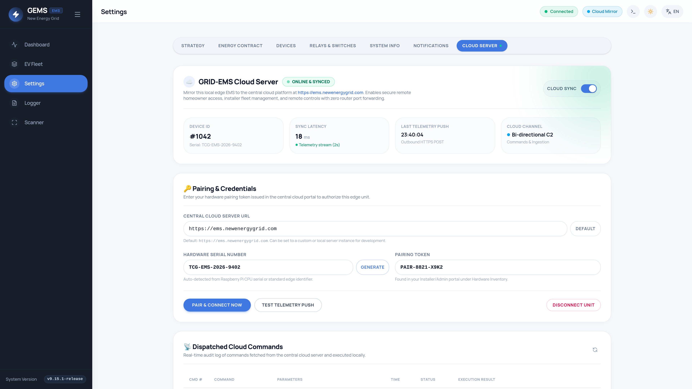

<h1 align="center">⚡ GEMS (Grid Energy Management System)</h1>

<p align="center">A lightweight, highly responsive, fully UI-driven Energy Management System (EMS) optimized for Raspberry Pi to monitor, control, automate, and optimize residential solar, battery, EV charging, and grid energy ecosystems.</p>

<p align="center">
  <a href="https://go.dev/"></a>
  <a href="https://vuejs.org/"></a>
  <a href="https://www.sqlite.org/"></a>
  <a href="https://www.raspberrypi.com/"></a>
  <a href="https://openchargealliance.org/"></a>
  <a href="LICENSE"></a>
</p>

<p align="center">
  <a href="manuals/gems-installer-manual.pdf"></a>
  <a href="manuals/gems-user-manual.pdf"></a>
  <a href="manuals/gems-server-connection-manual.pdf"></a>
  <a href="manuals/index.html"></a>
</p>

## Key Features

- **Hardware Target**: Deeply optimized for Raspberry Pi (Debian/Linux ARM64). CPU information is intentionally excluded from the UI to maintain a lightweight system profile. The system uses the release tag (`git describe --tags --always`) as its build number.
- **Monolithic Architecture**: A cohesive monolith featuring a Go (Golang) backend acting as a unified API and web server, paired with a modern Vue 3 Single Page Application (SPA).
- **GRID-EMS-SERVER Cloud Integration**: Outbound-only TLS 1.3 mirroring to the central cloud platform (`https://ems.newenergygrid.com`). Supports periodic high-frequency telemetry ingestion, remote command dispatch (`set_strategy_mode`, `set_battery_mode`, `throttle_ev_charger`, `set_relay`), cryptographic device secret authentication, and zero-inbound-port security.
- **Minimal SD Card Wear**: Utilizes a highly tuned local SQLite database configured with Write-Ahead Logging (WAL) mode and batched, in-memory transactional writes.
- **Fully UI-Driven**: Zero YAML configuration required. Add, configure, and remove hardware devices entirely through an intuitive frontend UI.
- **90+ Native Hardware Templates**: Native support for 80+ leading manufacturers covering Solar Inverters, Batteries, EV Chargers (OCPP 1.6-J / 2.0.1, Modbus TCP, REST), P1 Smart Meters, and Smart Relays.
- **Dynamic Site Optimization Strategies**:
  - *Eco Mode*: Maximizes self-consumption of solar energy and prioritizes local storage over grid feed-in.
  - *Flanders Mode (Predictive Peak Shaving & Monthly Peak Tracking)*: Continuously tracks 15-minute rolling average grid import in SQLite. Proactively throttles EV chargers and discharges home batteries to keep the projected quarter peak under `capacity_peak_limit_kw`. Features a **Smart Adaptive Ceiling** that dynamically adapts to the month's maximum peak so homeowner charging speed is maximized without increasing capacity tariff costs. Protects legacy Flemish solar systems with **Groenestroomcertificaten (GSC)** value protection presets (€90, €210, €230, €250, €270, €330, €350, €450/MWh), ensuring solar feed-in remains profitable during negative spot hours.
  - *Netherlands Mode (Smart Saldering & Zero-Export)*: Zero-export constraint logic to limit solar feed-in, including `min_profitable_export_price` and negative injection fee protection.
  - *Dynamic Battery Arbitrage*: Integrates EPEX Spot Day-Ahead prices to force charge batteries during cheap/negative hours and discharge during peak market pricing.
- **Belgian Energy Market & Regional Provider Presets**: Native calculation models for TotalEnergies Pixel Dynamic, Mega Smart/Cosy Dynamic, Bolt Dynamisch, Engie Dynamic / Flextime, Luminus Dynamic, Eneco Dynamic, Frank Energie, Ecopower, Dats 24, Octa+, Trevion, Aspiravi, and Belgian Dual-Tariff (Piek/Dal + 6% BTW), with DNO distribution presets for Flanders (Fluvius), Brussels (SIBELGA), and Wallonia (ORES, RESA).
- **Live 24-Hour Effective Tariff Curve Visualizer**: Interactive stacked cost breakdown displaying wholesale spot, supplier markup, DNO network tariffs, excise & 6% VAT, dynamic solar injection price, and negative price curtailment warnings.
- **EV Charger Integration (Preferred Modbus TCP & Native OCPP)**: Direct local control supporting sub-second dynamic current throttling (6A–32A) for Flanders peak shaving and solar matching. **Modbus TCP** is preferred for instantaneous response and allows chargers to remain connected to cloud CPO / split-billing platforms (E-Flux, Road, Optimile, Easee Cloud) over OCPP simultaneously. Alternatively, a built-in native **OCPP 1.6-J / 2.0.1** WebSocket server (`ws://<ems-ip>:8887/<ChargePointID>`) is available for standalone chargers.
- **Subnet Network Scanner**: Zero-dependency local network scanner leveraging localized MAC OUI maps to instantly discover and identify supported hardware on your network.
- **Interactive Energy Flow Chart**: Hero element on the dashboard showing active power flow between Grid, Solar, Battery, and Chargers. Clicking any node opens dedicated historical charts and detailed metrics.
- **Reporting & Data Exporting**: Export structured technical logs (`.txt`) via Logger UI and visual energy reports (Daily, Weekly, Monthly, Yearly) in PDF format.
- **Manual & OTA Software Updates**: Support for both automated online OTA updates via GitHub releases and manual offline upload of Debian packages (`.deb`) via the System Info UI.
- **Notifications & Webhook Alerts**: Webhook alerting logic for system errors, consecutive polling failures, and capacity thresholds.

---

## 📸 User Interface Showcase

### ⚡ Dashboard & Live Power Flow
| Desktop PowerFlow Dashboard | Mobile Responsive View |
| :---: | :---: |
|  |  |

### 🔍 Click-to-Reveal Historical Modals
| Solar Production & Curtailment | Battery Telemetry & State-of-Charge |
| :---: | :---: |
|  |  |

| Grid Import/Export & Capacity Peak | EV Charger History & Setpoint |
| :---: | :---: |
|  |  |

### ⚙️ Strategy & Dynamic Optimization
| Flanders Peak Shaving & Capacity Limits | Multi-Strategy Operational Modes |
| :---: | :---: |
|  |  |

### 💶 Dynamic Energy Contract & 24h Tariff Curve
| Supplier Contract & Tax Formulas | 24h Interactive Tariff Breakdown Visualizer |
| :---: | :---: |
|  |  |

### 🔌 Device Management & Template Wizards
| Configured Devices Management | Add Device Category Wizard |
| :---: | :---: |
|  |  |

| Inverter Modbus TCP Configuration | Smart Meter P1 Serial/Network Form |
| :---: | :---: |
|  |  |

| EV Charger Setup (Modbus TCP & OCPP) | Smart Relays & Automation Rules |
| :---: | :---: |
|  |  |

### 🛠️ Diagnostics, System Info, Webhook Alerts & Central Cloud
| Subnet Hardware Scanner | Real-Time Diagnostics Logger |
| :---: | :---: |
|  |  |

| Hardware Info & NVMe Wear Diagnostics | Webhook Alerts & Automated Reports |
| :---: | :---: |
|  |  |

| Central Cloud Server (GRID-EMS-SERVER) | |
| :---: | :---: |
|  | |

---

## 🔌 Supported Devices & Step-by-Step Onboarding

GEMS includes **90 native hardware templates**. Adding a device requires 4 simple steps in the web UI:

1. **Scan Subnet**: Go to **Scanner** in the sidebar to discover your device IP and MAC vendor.
2. **Prepare Hardware**: Enable Modbus TCP in your inverter dongle (e.g. Huawei SDongleA, SMA Speedwire, SolarEdge SetApp), enable Modbus TCP in your EV charger (preferred for sub-second throttling & CPO billing coexistence) or configure the charger's OCPP Server URL (`ws://<GEMS-IP>:8887/<ID>`), or toggle *Local API* in your HomeWizard/Shelly app.
3. **Add Device in UI**: Navigate to **Settings &rarr; Devices &rarr; + Add Device**, select the category, choose the template, and enter the IP/serial parameters.
4. **Verify Telemetry**: Verify that the device card displays <span style="color:#10b981; font-weight:bold;">● Online</span> and watch real-time energy flow on the Dashboard.

### Quick Reference Matrix

| Category | Supported Brands & Templates | Primary Protocols | Key Setup Parameters |
| :--- | :--- | :--- | :--- |
| **Solar & Hybrid Inverters** *(24 templates)* | Huawei SUN2000, SMA Sunny Boy/Tripower, Solis Hybrid, Fronius Gen24/Symo, GoodWe, Growatt, SolarEdge, SolaX, SofarSolar, Sungrow, Victron GX, Deye, Sunsynk, FoxESS, SAJ, Senergy, Sigenergy, Enerlution, Alpha ESS, Anker, Afore, Marstek, LG ESS, Enphase | Modbus TCP (Port 502 / 1502), SunSpec, REST | Host IP, Port, Modbus Slave ID (e.g. `1` or `126`), Rated kW |
| **EV Charging Stations** *(38 templates)* | **Modbus TCP (Preferred)**: RAEDIAN NEO/NEX/Gemini, KEBA P30/P40, Webasto Live/Next, Peblar, Phoenix Contact Charx, Veton, Alfen Eve, Mennekes AMTRON, ABB Terra AC, SolarEdge Home EVSE, ABL, Sigenergy, GoodWe HCA, Enovates, ETEK, Etrel.<br>**OCPP 1.6-J / 2.0.1**: Huawei FusionCharge, EVBox Elvi/Livo, SMA EV Charger, Schneider EVlink, Siemens VersiCharge, Elli/VW ID. Charger, Alpitronic, Autel, Hager, BMW, Mercedes, Porsche, Fronius Wattpilot, Easee.<br>**REST / Cloud**: go-e Charger Gemini, SmartEVSE, Wallbox Pulsar, Zaptec Go | Modbus TCP (Port 502, Preferred for sub-second throttling & CPO coexistence), Native OCPP WebSocket (Port 8887), HTTP REST | Host IP & Modbus Slave ID (for Modbus TCP) or ChargePoint ID (for OCPP), Charge Mode |
| **Grid & Smart Meters** *(26 templates)* | P1 DSMR USB/Serial, P1 Network TCP Bridge, HomeWizard Wi-Fi P1, Homey Energy Dongle, Shelly 3EM, Shelly Pro 3EM / Gen3 3EM-63T, Eastron (SDM120/230/630/72D/X96), Carlo Gavazzi (EM112/340/540/24), ABB (A43/B23), Schneider Acti9, Siemens PAC2200, SMA Energy Meter 2.0, Socomec, WAGO 879, Eltako, Finder, Inepro, Lovato, Acrel, ESPHome, Loxone, Niko | Serial DSMR, Modbus TCP, Local REST, UDP | Serial Port (`/dev/ttyUSB0`) & Baud (`115200`), or Host IP & Port |
| **Smart Relays & Contactors** *(2 templates)* | Shelly Plus 1PM, Pro 1PM, Plug S, Generic HTTP Relay | Local Gen 2 REST, HTTP JSON | Host IP, Port 80, Excess Solar Threshold (W) |

> 📖 **Full Step-by-Step Manuals for Every Device**: See the interactive [Device Reference Manual](manuals/devices.html) or [docs/user_manual.md](docs/user_manual.md).

---

## 🛠️ Official Reference Hardware

GEMS is designed, tested, and validated on the following reference hardware:

| Component | Hardware Specification | Standard / Requirement |
| :--- | :--- | :--- |
| **System Controller & Base** | **Raspberry Pi 5 Reference Hardware**<br>• Raspberry Pi 5 (4GB or 8GB RAM)<br>• Official 27W USB-C PD Power Supply (5V / 5A)<br>• Aluminum Enclosure with Active Cooler<br>• M.2 NVMe PCIe HAT / Base & 16-pin FPC cable<br>• MicroSD Card (for initial bootloader setup) | Recommended reference hardware platform |
| **Internal High-Speed Storage** | **128GB+ M.2 NVMe SSD**<br>• Form Factor: M.2 2280 (or 2230/2242) M-Key<br>• Interface: PCIe Gen 3.0 / Gen 2.0 x4 NVMe<br>• High endurance, low power consumption<br>• Read: up to 1,600+ MB/s / Write: up to 600+ MB/s | Solid-state NVMe storage for zero wear & sub-second latency |

> 📖 **Full Hardware Specifications & Pinouts**: See [docs/hardware_reference.md](docs/hardware_reference.md).

---

## ⚡ NVMe SSD Bootloader Setup (Enabling NVMe Storage & Boot)

When using a brand-new Raspberry Pi 5 with an NVMe HAT and an M.2 NVMe SSD, the board's factory EEPROM is set to boot exclusively from SD card (`BOOT_ORDER=0xf41`) and does not probe PCIe storage.

### 🌟 3-Minute Quick Fix (Using Raspberry Pi Imager)
1. Insert a MicroSD card into your computer.
2. Open **[Raspberry Pi Imager](https://www.raspberrypi.com/software/)** &rarr; Choose Device: **Raspberry Pi 5** &rarr; Choose OS: **Misc utility images** &rarr; **Bootloader** &rarr; **NVMe/PCIe Boot**.
3. Choose your MicroSD card and click **Write**.
4. Assemble the M.2 NVMe SSD onto the Pi 5 NVMe HAT, insert the MicroSD card, and connect the official 27W power supply.
5. In ~5 seconds, the ACT LED flashes rapidly and the HDMI screen turns **solid green**, confirming the EEPROM is updated (`BOOT_ORDER=0xf461`, `PCIE_PROBE=1`).
6. Unplug power, remove the MicroSD card, and flash `gems-os-image.img.xz` directly to the NVMe SSD (or see [docs/nvme_boot_guide.md](docs/nvme_boot_guide.md) to flash from terminal).
7. Power on without the SD card—the system boots from the NVMe SSD in under 8 seconds!

> 📖 **Detailed NVMe Troubleshooting & Diagnostics**: See [docs/nvme_boot_guide.md](docs/nvme_boot_guide.md).

---

## Deployment & Installation

GEMS is primarily deployed via automated GitHub release artifacts: a pre-configured custom Raspberry Pi OS image and a Debian (`.deb`) package.

### Option A: Custom Raspberry Pi OS Image (Recommended)

The easiest way to deploy GEMS is flashing the pre-built custom Raspberry Pi OS Lite (Bookworm ARM64) image onto an SD card or NVMe SSD.

1. Download `gems-os-image.img.xz` from the latest GitHub release tag (`v*`).
2. Flash the `.img.xz` archive directly using [BalenaEtcher](https://etcher.balena.io/) or [Raspberry Pi Imager](https://www.raspberrypi.com/software/).
3. Insert the media into your Raspberry Pi and boot.

**Out-of-the-Box Setup**:
- **Hostname**: `ems` (accessible at `http://ems` or `http://ems.local`).
- **Nginx Reverse Proxy**: Pre-configured with SSL and WebSocket/SSE proxy support routing to GEMS on port 8080.
- **Kiosk Desktop**: Minimal Wayland desktop (`wayfire`) autostarting Chromium in kiosk mode targeting `http://ems.local`.
- **Cockpit Web Terminal**: Web-based terminal and system monitoring available on port `9090` (Login: `admin`, Password: `manufacturer`).
- **Raspberry Pi Connect**: Pre-installed and pre-configured for unattended remote screen sharing with automatic connection acceptance.
- **NVMe Ready**: `dtparam=pciex1` and `dtparam=pciex1_gen=2` pre-configured out-of-the-box.

See [Remote Access Documentation](docs/remote_access.md) for details on Cockpit and Raspberry Pi Connect pairing.

---

### Option B: Install via Debian Package (.deb)

If you have an existing Debian/Ubuntu ARM64 installation on your Raspberry Pi:

1. Download the latest `gems_*_arm64.deb` package from the release assets.
2. Install the package:
   ```bash
   sudo dpkg -i gems_*_arm64.deb
   sudo apt-get install -f # resolve any missing runtime dependencies
   ```

The package automatically creates a restricted `gems` system user, installs the server binary and compiled frontend to `/opt/gems`, and enables and starts `gems.service` via systemd.

---

### Building from Source

To build GEMS locally from source code:

#### Prerequisites
- Node.js 22+ (for building the Vue 3 SPA)
- Go 1.24+ (for compiling the backend)
- C cross-compiler for ARM64 (`gcc-aarch64-linux-gnu` and `libc6-dev-arm64-cross`) if compiling on non-ARM64 hosts due to `mattn/go-sqlite3` CGO dependencies.

#### Build Command
```bash
git clone https://github.com/webdotpulse/GRID-EMS.git
cd GRID-EMS
./build.sh
```

*Output artifact*: `build/gems-release-arm64.tar.gz` (contains `gems-server` binary and `dist/` web assets).

---

## Documentation Library

| Guide | Description |
| :--- | :--- |
| 📕 **[Installer & Commissioning Manual (PDF)](manuals/gems-installer-manual.pdf)** | **Official printable PDF guide for installers** (Hardware BOM, NVMe setup, onboarding 90+ devices, grid limits, Flanders peak shaving, GSC protection, and webhook alerts) |
| 📗 **[Homeowner & User Manual (PDF)](manuals/gems-user-manual.pdf)** | **Official printable PDF guide for end-users** (PowerFlow hero diagram, click-to-reveal modals, EV charging modes, 24h tariff visualizer, smart relays, and PDF reports) |
| ☁️ **[GRID-EMS-SERVER Connection Manual (PDF)](manuals/gems-server-connection-manual.pdf)** | **Official printable PDF guide for cloud & fleet integration** (Outbound TLS 1.3 architecture, hardware token pairing, JSON telemetry ingestion, and remote commands) |
| 💻 [Interactive HTML Documentation Hub](manuals/index.html) | Rich web documentation suite with full-text search (open in browser) |
| 🛠️ [Interactive Installer Manual (HTML)](manuals/gems-installer-manual.html) | Comprehensive field commissioning guide with high-res screenshots and hardware wiring |
| 🏠 [Interactive User Manual (HTML)](manuals/gems-user-manual.html) | Illustrated homeowner operations manual with interactive modals and tariff breakdown |
| ☁️ [Interactive Cloud Server Manual (HTML)](manuals/cloud-server.html) | Web guide for connecting edge GEMS units to central GRID-EMS-SERVER |
| 🔌 [Device Manuals & Templates](manuals/devices.html) | Complete step-by-step guides for all 90 supported hardware templates |
| 📘 [User Manual (Markdown)](docs/user_manual.md) | End-user operations, PowerFlow diagram, OCPP server setup |
| 📖 [Advanced Operational Manual](docs/advanced_manual.md) | Technical deep-dive on algorithms, formulas, and SG-Ready contactors |
| ⚡ [NVMe Boot & Setup Manual](docs/nvme_boot_guide.md) | Complete guide for Raspberry Pi 5 + M.2 NVMe SSD |
| 🛠️ [Hardware Reference BOM](docs/hardware_reference.md) | Tested reference BOM, power requirements, RS485/P1 pinouts |
| 🌐 [Remote Access Guide](docs/remote_access.md) | Cockpit terminal on port 9090 and Raspberry Pi Connect pairing |
| ⚙️ [Settings & Strategy Reference](docs/settings.md) | Full reference of all UI parameters, contract formulas, and tariff curves |

---

## Project Structure

```
GRID-EMS/
├── .github/workflows/
│   └── release.yml        # Unified CI/CD pipeline for DEB & Raspberry Pi OS image releases
├── backend/
│   ├── main.go            # Entry point, HTTP server, systemd & SQLite setup
│   ├── api.go             # REST API handlers & PDF export routes
│   ├── poller.go          # Hardware poller interface & device loops
│   ├── state.go           # SSE live streaming & SQLite time-series storage
│   ├── strategy.go        # Site optimization & control strategy evaluation loop
│   ├── pricing.go         # EPEX Day-Ahead price integration & dynamic tariffs
│   └── internal/          # Domain models, OCPP server, & 90 device template plugins
├── frontend/
│   ├── src/components/    # Vue 3 UI cards, PowerFlow hero graphic, & device forms
│   └── src/types/         # TypeScript interfaces
├── config/
│   └── wayfire.ini        # Wayfire autostart configuration for Chromium kiosk mode
├── scripts/
│   ├── capture_screenshots.js # Automated Chromium screenshot capture suite
│   └── setup-remote-access.sh # Remote access setup utility script
├── docs/                  # Architecture, User Manual, NVMe Guide, Hardware BOM
├── manuals/               # Interactive HTML documentation suite with search
└── build.sh               # Local build script for ARM64 release bundling
```
