# 📖 GEMS - Advanced Operational Manual

Welcome to the **GEMS Advanced Operational Manual**. This document provides an exhaustive, step-by-step guide explaining how every feature, configuration setting, regional strategy, automation rule, dynamic contract engine, and diagnostic tool in GEMS functions.

> [!TIP]
> **Download Official Field Manuals (PDF):**
> - 📕 **[GEMS Installer & Commissioning Manual (PDF)](../manuals/gems-installer-manual.pdf)** (5.7 MB)
> - 📗 **[GEMS Homeowner & User Manual (PDF)](../manuals/gems-user-manual.pdf)** (3.5 MB)
> - ☁️ **[GEMS GRID-EMS-SERVER Connection Manual (PDF)](../manuals/gems-server-connection-manual.pdf)** (1.1 MB)
> - 💻 **[Interactive Documentation Hub](../manuals/index.html)**

---

## 📑 Table of Contents
1. [Architecture & System Overview](#1-architecture--system-overview)
2. [Dashboard & Hero Energy Flow Monitor](#2-dashboard--hero-energy-flow-monitor)
3. [Regional Strategy Engine](#3-regional-strategy-engine)
4. [Smart Relay & SG-Ready Automation](#4-smart-relay--sg-ready-automation)
5. [Dynamic Tariffs & Contract Calculations](#5-dynamic-tariffs--contract-calculations)
6. [Device Management & Modbus Diagnostics](#6-device-management--modbus-diagnostics)
7. [Native OCPP EV Charging Server](#7-native-ocpp-ev-charging-server)
8. [System Maintenance, Logs & Updates](#8-system-maintenance-logs--updates)

---

## 1. Architecture & System Overview

GEMS (Grid Energy Management System by New Energy Grid) is engineered for minimal memory consumption and maximal performance on Raspberry Pi hardware (Debian/Linux ARM64).

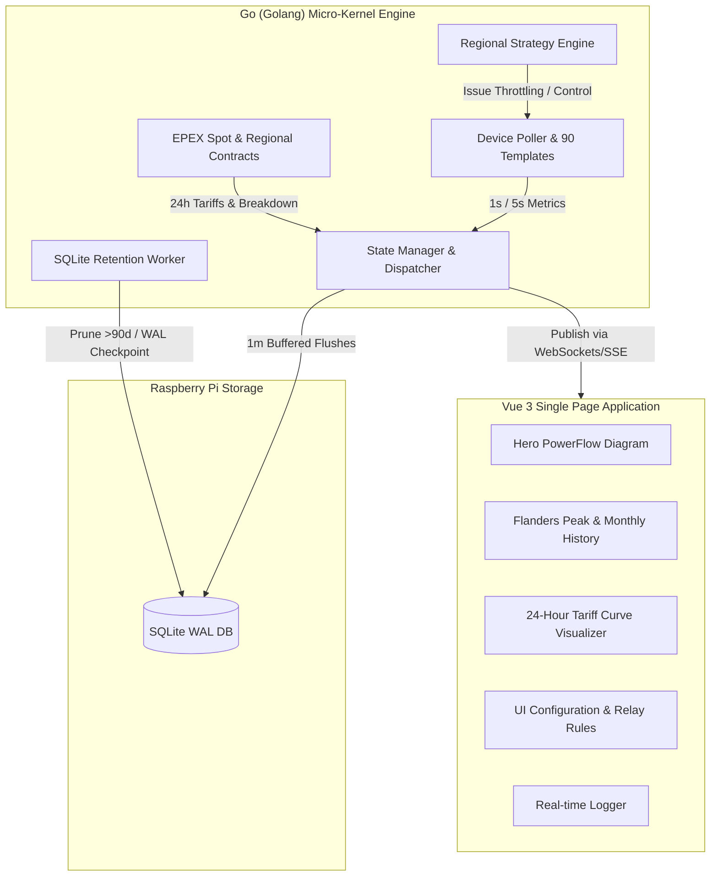
```mermaid
graph TD
    subgraph Frontend ["Vue 3 Single Page Application"]
        PowerFlow["Hero PowerFlow Diagram"]
        DashGauge["Flanders Peak & Monthly History"]
        TariffVis["24-Hour Tariff Curve Visualizer"]
        SettingsUI["UI Configuration & Relay Rules"]
        LogsUI["Real-time Logger"]
    end

    subgraph Backend ["Go (Golang) Micro-Kernel Engine"]
        Poller["Device Poller & 90 Templates"]
        Strategy["Regional Strategy Engine"]
        Pricing["EPEX Spot & Regional Contracts"]
        State["State Manager & Dispatcher"]
        Pruning["SQLite Retention Worker"]
    end

    subgraph Storage ["Raspberry Pi Storage"]
        DB[(SQLite WAL DB)]
    end

    Poller -->|1s / 5s Metrics| State
    Pricing -->|24h Tariffs & Breakdown| State
    State -->|Publish via WebSockets/SSE| Frontend
    Strategy -->|Issue Throttling / Control| Poller
    State -->|1m Buffered Flushes| DB
    Pruning -->|Prune >90d / WAL Checkpoint| DB
```

> [!NOTE]
> **Raspberry Pi Optimization & NVMe Storage:** GEMS is officially verified on the [db-tronic Raspberry Pi 5 NVMe Kit](https://www.amazon.com.be/-/en/dp/B0GZ65XG3G?ref=ppx_yo2ov_dt_b_fed_asin_title&th=1) and [Patriot P300 128GB M.2 NVMe SSD](https://www.amazon.com.be/-/en/dp/B0822Y6N1C?ref=ppx_yo2ov_dt_b_fed_asin_title&th=1). Database writes are buffered in memory and written in 1-minute transaction batches. SQLite Write-Ahead Logging (`WAL`) and periodic non-blocking downsampling prevent SD card wear and ensure sub-millisecond query latency on NVMe storage.

---

## 2. Dashboard & Hero Energy Flow Monitor

The **Dashboard** is the primary monitoring screen of GEMS.

| Desktop PowerFlow Dashboard | Mobile Responsive View |
| :---: | :---: |
| 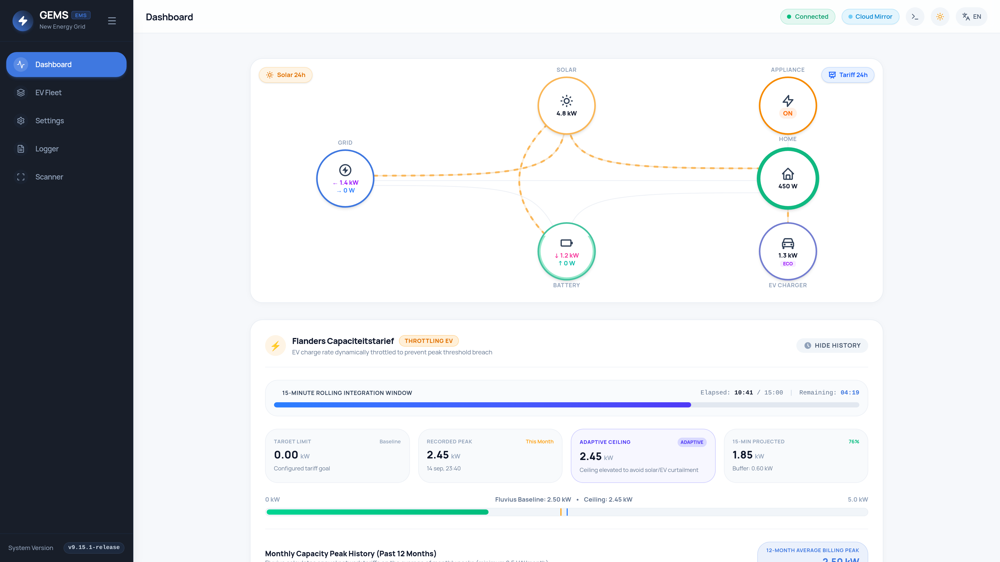 | 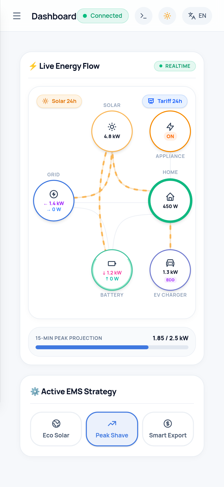 |

### 2.1 Hero Interactive Power Flow Chart (`PowerFlow.vue`)
* **Dynamic Node Rendering:** Grid, Solar Inverter, Battery Storage, EV Charger, and Smart Relays are displayed **only** if configured and active.
* **Animated Power Vectors:** Moving particle lines indicate real-time direction and velocity of energy flow.
* **Click-to-Reveal History Modal:** Clicking any node (e.g. Grid, Battery, Solar, EV Charger) opens a high-resolution historical chart modal with energy totals, self-consumption ratios, and date range filters (Day, Week, Month, Year).

| Battery Telemetry Modal | Solar Production Modal |
| :---: | :---: |
| 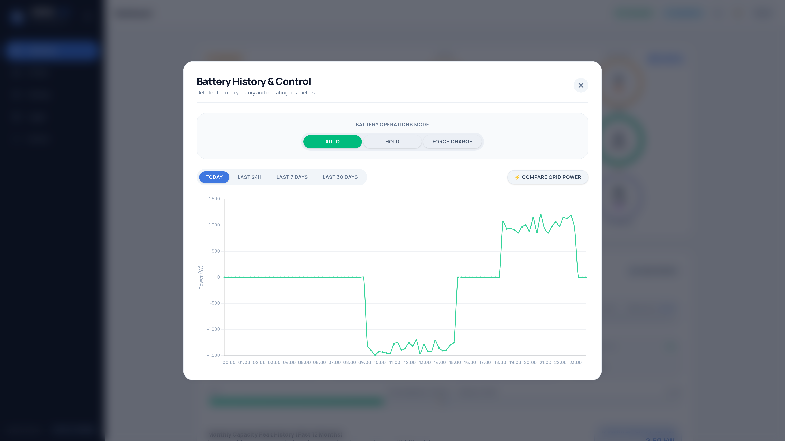 | 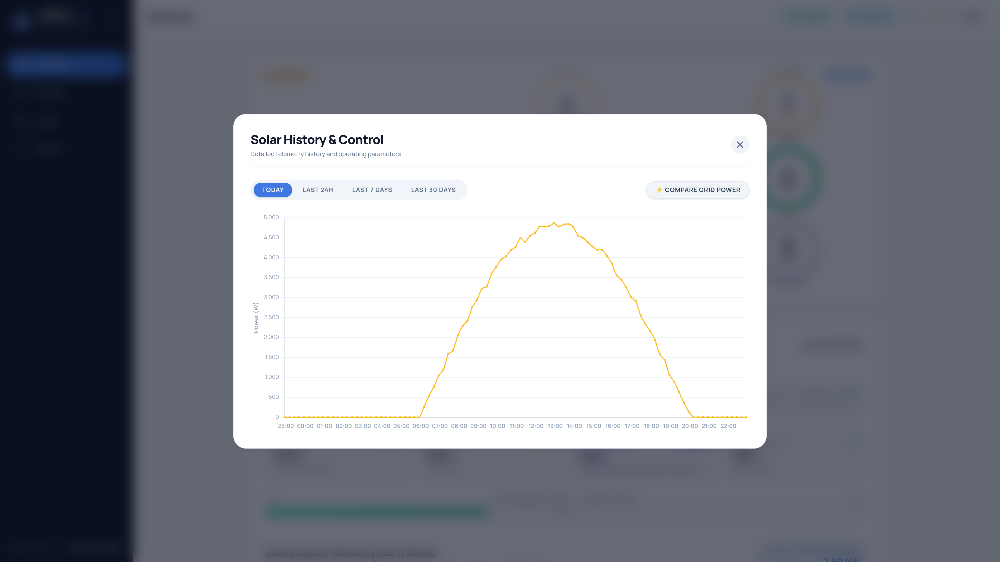 |

| Grid Import/Export Modal | EV Charger History Modal |
| :---: | :---: |
| 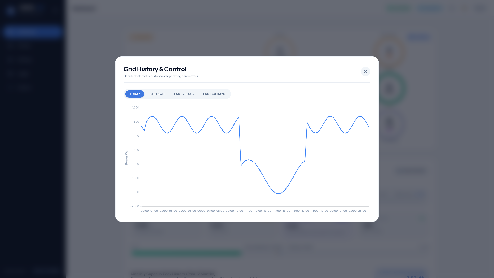 | 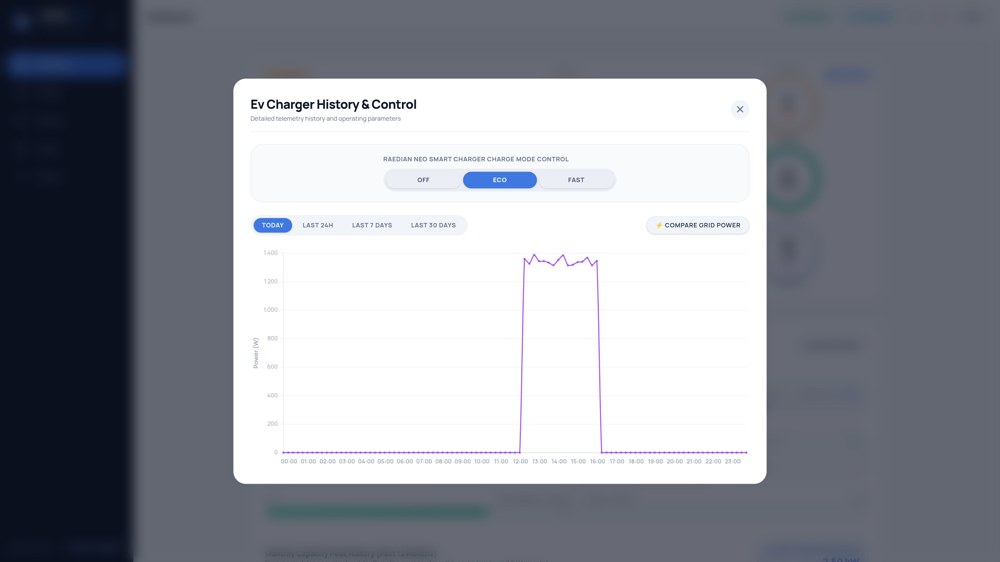 |

### 2.2 Flanders Quarter-Hour Peak Demand Monitor (`capaciteitstarief`)
* **Ground-Truth OBIS 1.6.0 Ingestion:** Ingests the digital meter's current quarter-hourly maximum demand reading.
* **Projected Quarter Peak Calculation:** Mathematically projects the expected 15-minute average power based on elapsed seconds and current grid draw:
  $$P_{\text{projected}} = \frac{E_{\text{elapsed}} + P_{\text{inst}} \times (900 - t_{\text{elapsed}})}{900}$$
* **Monthly Peak Tracking & Smart Adaptive Ceiling:** GEMS tracks the true monthly peak in SQLite (`/api/peaks/monthly`). If a high peak is incurred during the month, the ceiling dynamically elevates to allow maximum charging speed without exceeding that peak.
* **Status Badges:**
  * **NORMAL (Green):** Projected peak $<80\%$ of contract limit (`capacity_peak_limit_kw`).
  * **WARNING (Amber):** Projected peak between $80\%$ and $99\%$ of contract limit.
  * **THROTTLED (Red):** Projected peak $\ge 100\%$ of contract limit; active throttling engaged.

### 2.3 Visual PDF Energy Report Exporter
* Generates downloadable PDF reports directly from the Dashboard.
* Options for **Last Week**, **Last Month**, **Last 12 Months**, and **All Time** summary metrics.

---

## 3. Regional Strategy Engine

Select your active operational strategy under **Settings &rarr; Site Optimization**:

| Strategy Settings Overview | Operational Strategy Modes |
| :---: | :---: |
| 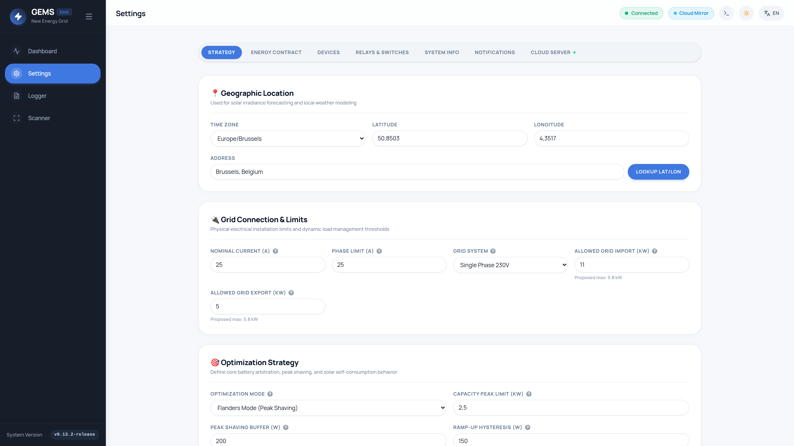 | 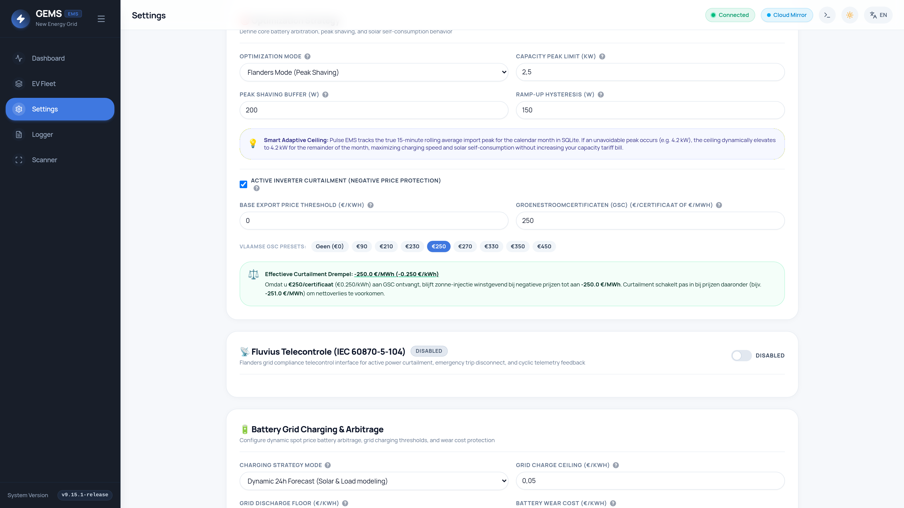 |

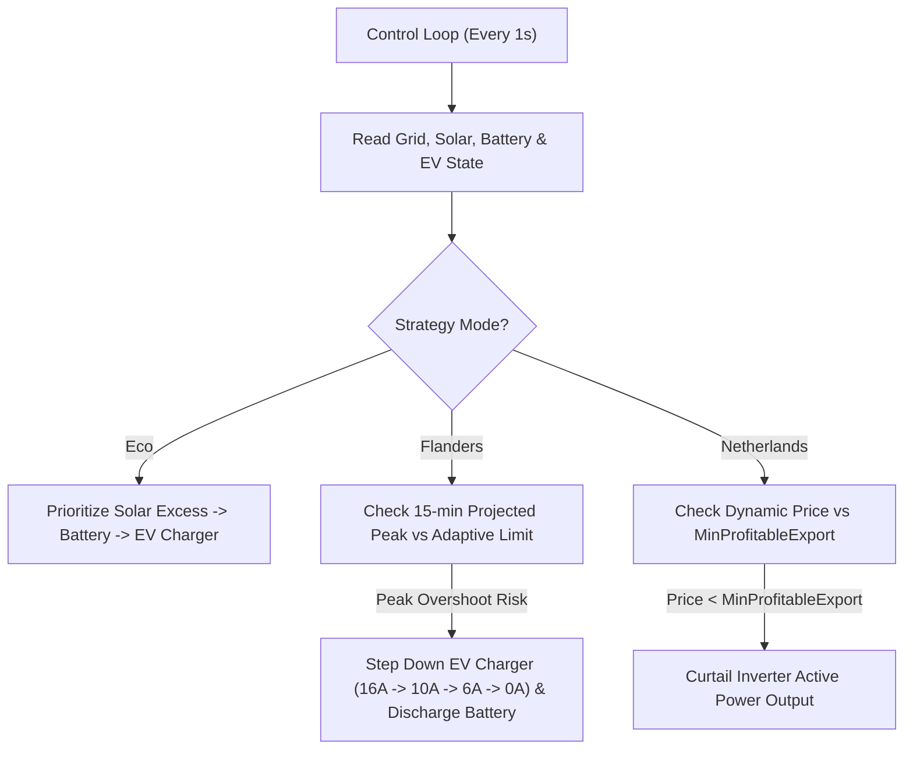
```mermaid
flowchart TD
    Start["Control Loop (Every 1s)"] --> ReadState["Read Grid, Solar, Battery & EV State"]
    ReadState --> ModeCheck{"Strategy Mode?"}

    ModeCheck -->|Eco| EcoMode["Prioritize Solar Excess -> Battery -> EV Charger"]
    ModeCheck -->|Flanders| FlandersMode["Check 15-min Projected Peak vs Adaptive Limit"]
    ModeCheck -->|Netherlands| NLMode["Check Dynamic Price vs MinProfitableExport"]

    FlandersMode -->|Peak Overshoot Risk| Throttling["Step Down EV Charger (16A -> 10A -> 6A -> 0A) & Discharge Battery"]
    NLMode -->|Price < MinProfitableExport| Curtailment["Curtail Inverter Active Power Output"]
```

### 3.1 Eco Strategy (`eco`)
* Maximizes solar self-consumption.
* Directs excess solar power first to home battery storage, then to EV chargers, and lastly to thermal/smart relays.

### 3.2 Flanders Peak Shaving Strategy (`flanders`)
* Designed for Belgium (Flanders) capacity tariff regulations.
* Monitors the 15-minute rolling average grid import.
* Dynamically throttles EV chargers and commands battery discharge when total household demand threatens to push the quarter-hourly peak above `capacity_peak_limit_kw`.
* Enforces `peak_shaving_buffer_w` and gradual `peak_shaving_rampup_w` when demand stabilizes.

### 3.3 Netherlands Smart Saldering & Zero-Export (`netherlands`)
* Addresses Dutch grid congestion and feed-in penalty fees.
* **Smart Saldering Sub-Setting:** Evaluates real-time EPEX spot prices against `min_profitable_export_price`.
* When injection prices fall below the threshold (or go negative), the strategy curtails solar inverter active power to match household consumption, eliminating unprofitable grid feed-in.

### 3.4 Dynamic Price Arbitrage & Battery Wear Modeling
* Calculates optimal battery charging windows using Day-Ahead EPEX spot prices.
* **Battery Degradation Wear Cost:** Factors configured battery cycle wear costs ($€/\text{kWh}$) into arbitrage spread calculations, ensuring a discharge cycle is executed only when price spreads exceed battery degradation costs.

### 3.5 3-Phase Phase-Aware Load Balancing
* Monitors per-phase currents ($L_1, L_2, L_3$) from 3-phase P1/Modbus smart meters.
* Enforces `phase_limit_amps` (e.g., $25\text{A}$ per phase). If any single phase nears the breaker limit, EV chargers are immediately throttled regardless of total aggregate 3-phase power.

---

## 4. Smart Relay & SG-Ready Automation

Configure automated switching rules for domestic hot water boilers, heat pumps, and heavy appliances in **Settings &rarr; Relays**.

| Smart Relays Management | Relay Automation Rules |
| :---: | :---: |
| 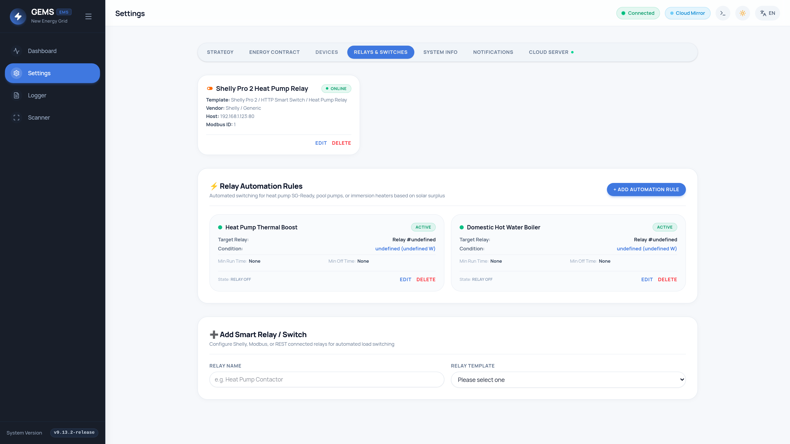 | 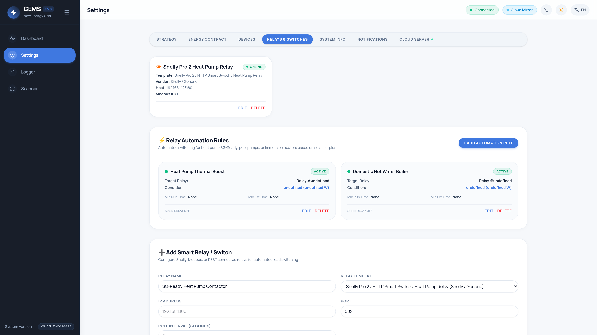 |

### 4.1 Automation Rule Parameters
* **Condition Types:**
  * `solar_export_exceeds`: Triggers when solar excess exported to the grid exceeds `threshold_watts`.
  * `grid_import_below`: Triggers when grid import falls below `threshold_watts`.
  * `price_below`: Triggers when dynamic electricity spot price drops below configured price.
* **Anti-Short-Cycling Safety Timers:**
  * `min_run_time_seconds`: Forces the relay to stay ON for a minimum duration once activated, preventing rapid cycling damage to compressors or contactors.
  * `min_off_time_seconds`: Forces the relay to remain OFF for a minimum rest duration before reactivation.

### 4.2 SG-Ready Heat Pump Operating Modes
GEMS maps relay contactor states to standard SG-Ready heat pump inputs:
1. **Mode 1 (Grid Lockout / EVU-Sperre):** Forces heat pump OFF during extreme peak periods.
2. **Mode 2 (Normal Operation):** Operates under internal thermostat schedules.
3. **Mode 3 (Solar Excess Recommended):** Increases temperature setpoints to store excess thermal energy.
4. **Mode 4 (Forced Warm-up):** Maximizes thermal storage during negative or zero-cost price windows.

---

## 5. Dynamic Tariffs & Contract Calculations

GEMS calculates real-time effective energy pricing by applying regional tax and provider formulas to raw Day-Ahead EPEX spot prices.

| Energy Contract Configuration | 24-Hour Tariff Visualizer Curve |
| :---: | :---: |
| 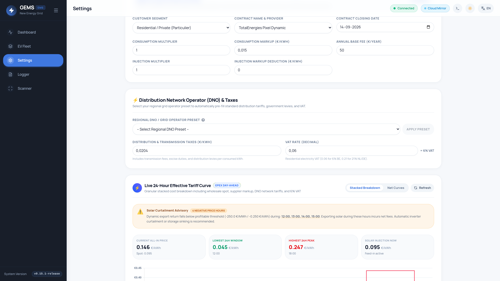 | 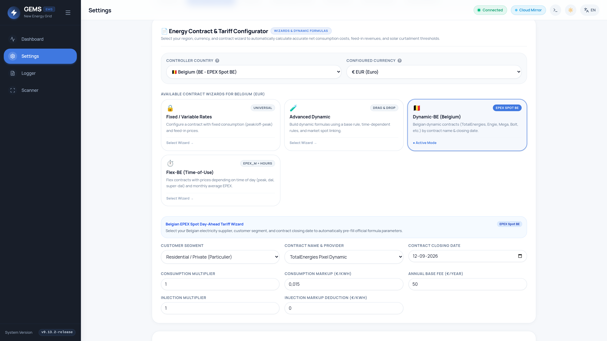 |

### 5.1 Supported Regional Provider Presets
* **TotalEnergies Pixel Dynamic (BE):** EPEX Spot BE + multiplier + markup + base subscription fee.
* **Mega Smart / Cosy Dynamic (BE):** Configurable consumption multiplier, retail markup, and injection fees.
* **Bolt Dynamisch (BE):** 100% local green dynamic contract with pass-through spot pricing.
* **Engie Dynamic & Flextime (BE):** Spot pass-through and multi-tier time-of-use markups.
* **Luminus, Eneco, Frank Energie, Ecopower, Dats 24, Octa+, Trevion, Aspiravi:** Regional Belgian formulas.
* **Belgian Dual-Tariff (Piek/Dal):** Standard peak/off-peak rates with 6% BTW and DNO presets.
* **Enovos (Luxembourg):** Dynamic pricing with Creos distribution fees.

### 5.2 Live 24-Hour Effective Tariff Curve Visualizer
The embedded visualizer breaks down electricity costs into 4 stacked components for every hour:
1. **Raw EPEX Spot Wholesale**
2. **Supplier Markup & Base Fee**
3. **DNO Grid & Transmission (Fluvius / ORES / RESA / SIBELGA)**
4. **Taxes & 6% VAT (BTW)**
Plus an overlaid stepped curve of **Solar Injection Return** with automated **Negative Price Curtailment Warnings**.

---

## 6. Device Management & Modbus Diagnostics

Manage all system hardware from **Settings &rarr; Devices**.

| Configured Devices Management | Add Device Wizard |
| :---: | :---: |
| 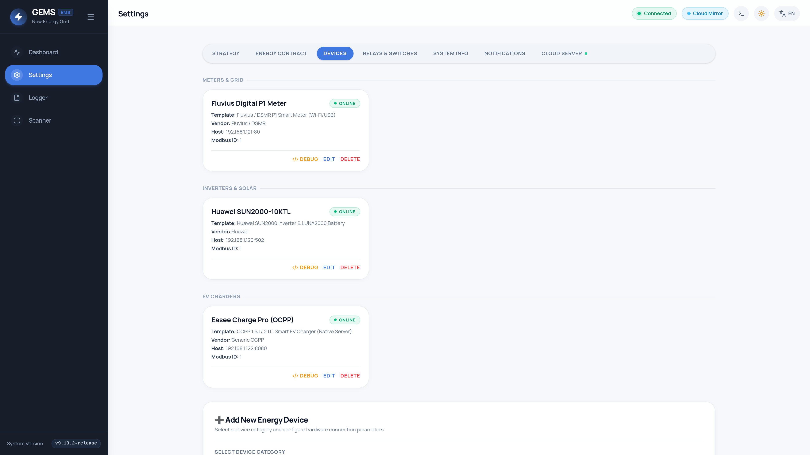 | 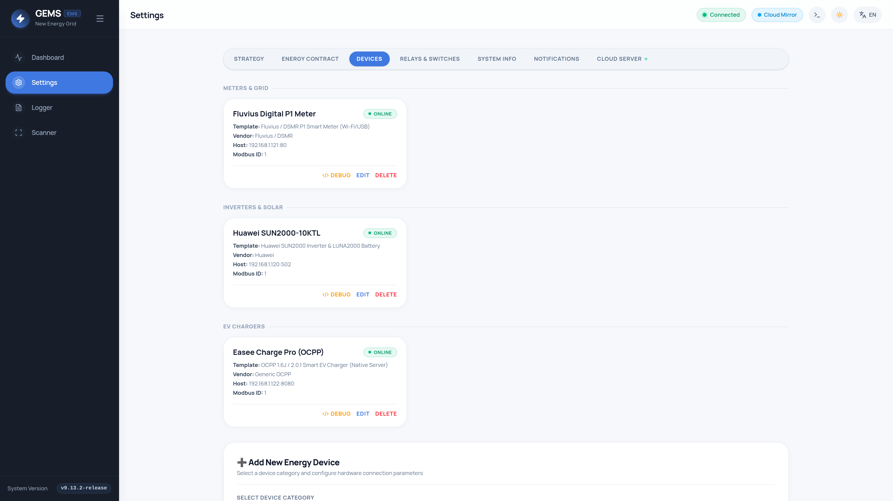 |

### 6.1 Network Scanner
* Click **Scanner** in the sidebar to discover connected IP devices across your local subnet.
* Uses OUI MAC matching to highlight solar inverters, smart meters, and EV chargers automatically.

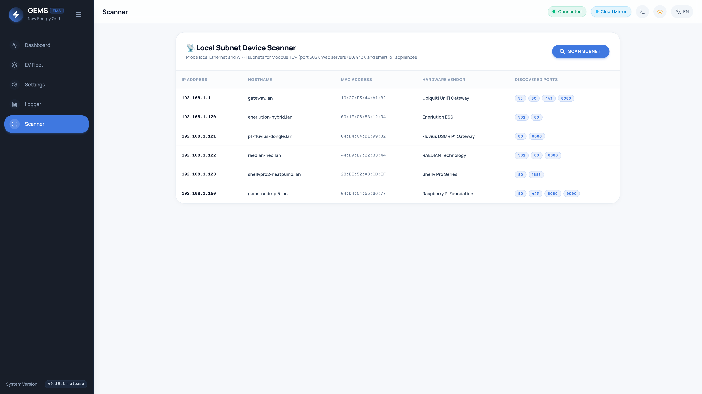

### 6.2 Modbus TCP Reachability Probe (`POST /api/devices/test-connection`)
* Click **Test Connection** inside any device dialog.
* Executes a 1-shot TCP connection probe from the Go backend, measuring network latency ($ms$) and reporting IP/Port reachability before saving settings.

---

## 7. EV Charging: Modbus TCP & Native OCPP Server

### 7.1 Modbus TCP Fieldbus Control (Recommended & Preferred)
**Modbus TCP is the preferred connection option for EV chargers**:
* **Sub-Second Response:** Modbus registers allow GEMS to read phase currents and write amperage limits (6A to 32A) immediately without WebSocket latency, essential for reactive Flanders capacity peak shaving and real-time solar curtailment tracking.
* **CPO / Split-Billing Coexistence:** If your charger connects to an employer billing reimbursement platform or commercial CPO (E-Flux, Road, Optimile, Easee Cloud) via OCPP, GEMS controls charging power locally over Modbus TCP *without disconnecting or interfering with your cloud billing service*.

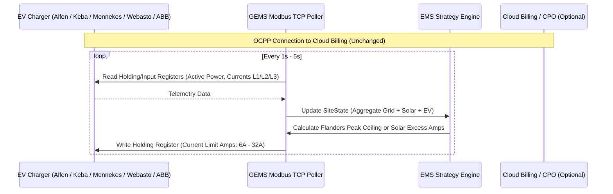
```mermaid
sequenceDiagram
    participant EVSE as EV Charger (Alfen / Keba / Mennekes / Webasto / ABB)
    participant GEMS as GEMS Modbus TCP Poller
    participant Logic as EMS Strategy Engine
    participant CPO as Cloud Billing / CPO (Optional)

    Note over EVSE,CPO: OCPP Connection to Cloud Billing (Unchanged)
    loop Every 1s - 5s
        GEMS->>EVSE: Read Holding/Input Registers (Active Power, Currents L1/L2/L3)
        EVSE-->>GEMS: Telemetry Data
        GEMS->>Logic: Update SiteState (Aggregate Grid + Solar + EV)
        Logic->>GEMS: Calculate Flanders Peak Ceiling or Solar Excess Amps
        GEMS->>EVSE: Write Holding Register (Current Limit Amps: 6A - 32A)
    end
```

### 7.2 Native OCPP 1.6-J / 2.0.1 Server (Direct Alternative)
For chargers without Modbus TCP or standalone residential setups without third-party CPO billing platforms, GEMS includes an embedded, zero-dependency **OCPP 1.6-J / 2.0.1 Server**:

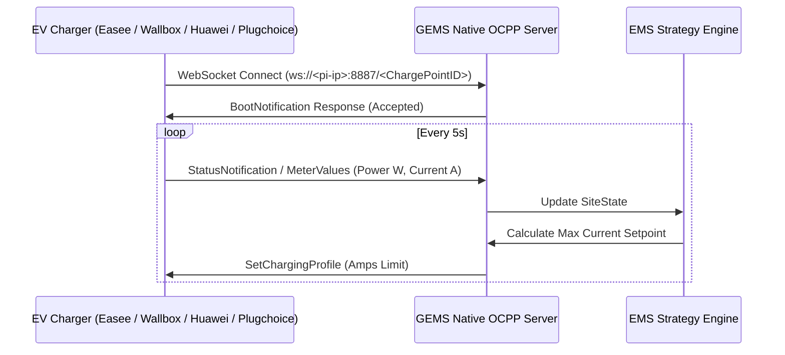
```mermaid
sequenceDiagram
    participant EVSE as EV Charger (Easee / Wallbox / Huawei / Plugchoice)
    participant GEMS as GEMS Native OCPP Server
    participant Logic as EMS Strategy Engine

    EVSE->>GEMS: WebSocket Connect (ws://<pi-ip>:8887/<ChargePointID>)
    GEMS->>EVSE: BootNotification Response (Accepted)
    loop Every 5s
        EVSE->>GEMS: StatusNotification / MeterValues (Power W, Current A)
        GEMS->>Logic: Update SiteState
        Logic->>GEMS: Calculate Max Current Setpoint
        GEMS->>EVSE: SetChargingProfile (Amps Limit)
    end
```

> [!IMPORTANT]
> **No Cloud Dependency:** Third-party corporate CSMS proxying is disabled. EV chargers communicate directly with the local Raspberry Pi over local Modbus TCP or local WebSockets, ensuring charging continues even during internet outages.

---

## 8. System Maintenance, Logs & Updates

| Hardware System Info & Storage | Webhook Alerts & Reporting |
| :---: | :---: |
| 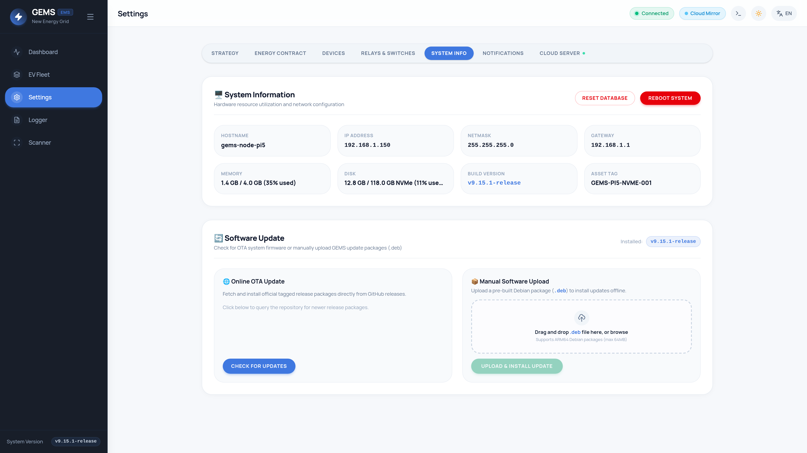 | 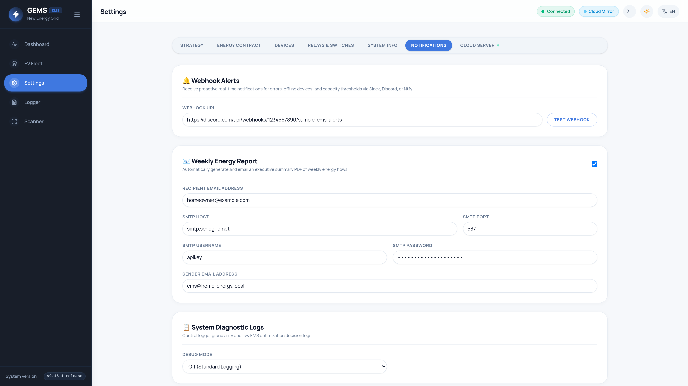 |

### 8.1 Real-Time Logger & Technical Export (`Logger.vue`)
* View system logs filtered by severity (`INFO`, `WARN`, `ERROR`, `DEBUG`).
* Export full technical logs via structured JSON or CSV download.

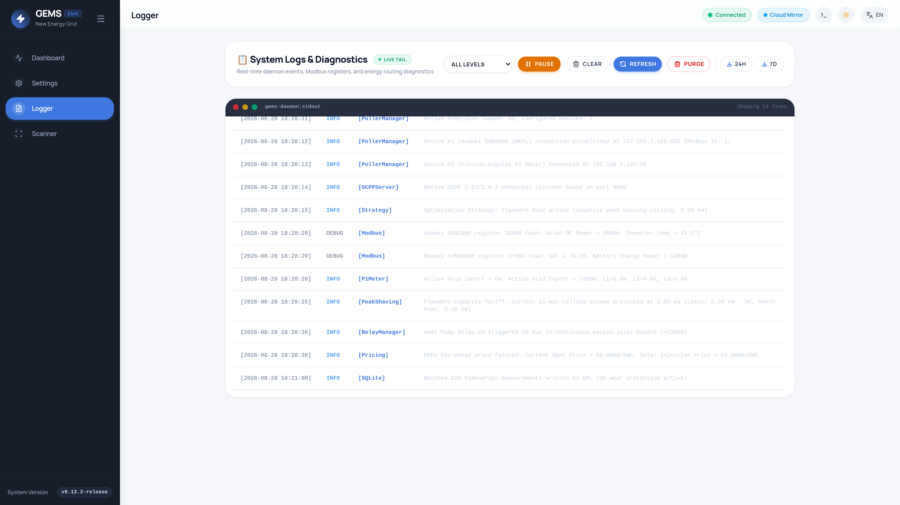

### 8.2 Cockpit Web Terminal Shortcut
* Access web-based Linux terminal and system performance monitoring by clicking the **Terminal** link in the navigation header (directs to `http://<pi-ip>:9090`).

### 8.3 One-Click Over-The-Air System Updates
* Navigate to **Settings &rarr; System Info** to check for new release tags on GitHub (`git describe --tags --always`).
* Click **Install Update** to transparently download and update the system via `.deb` package execution without losing database settings.

---
*Manual Version 9.2.0 — GEMS Documentation Team*
