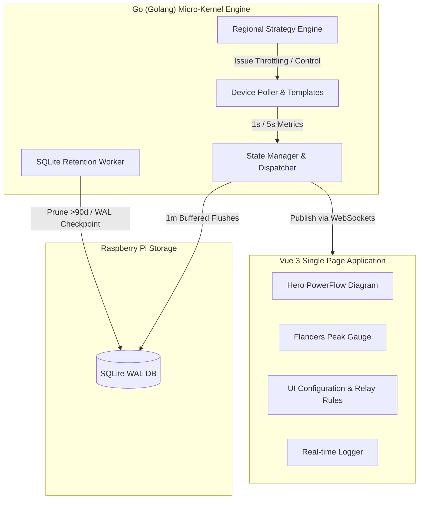
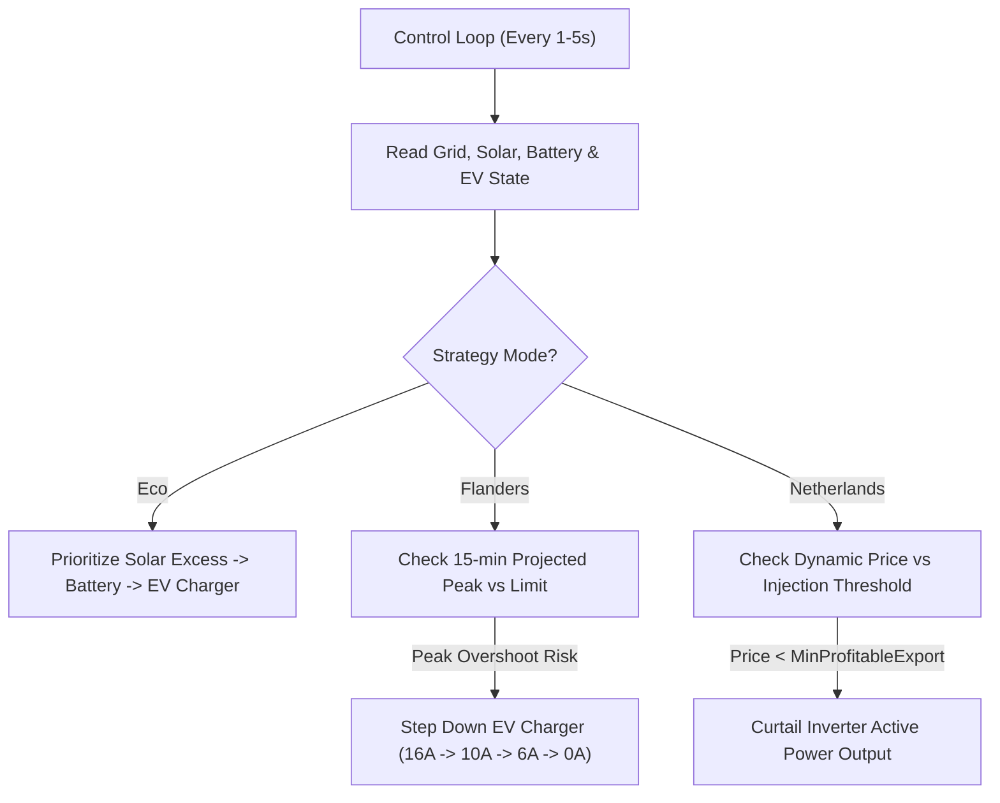
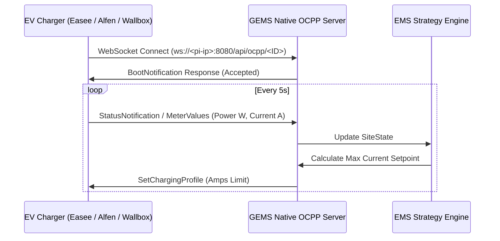

# 📖 GEMS - Advanced Operational Manual

Welcome to the **GEMS Advanced Operational Manual**. This document provides an exhaustive, step-by-step guide explaining how every feature, configuration setting, regional strategy, automation rule, and diagnostic tool in GEMS functions.

---

## 📑 Table of Contents
1. [Architecture & System Overview](#1-architecture--system-overview)
2. [Dashboard & Hero Energy Flow Monitor](#2-dashboard--hero-energy-flow-monitor)
3. [Regional Strategy Engine](#3-regional-strategy-engine)
4. [Smart Relay & SG-Ready Automation](#4-smart-relay--sg-ready-automation)
5. [Dynamic Tariffs & Contract Calculations](#5-dynamic-tariffs--contract-calculations)
6. [Device Management & Modbus Diagnostics](#6-device-management--modbus-diagnostics)
7. [Native OCPP EV Charging Server](#7-native-ocpp-ev-charging-server)
8. [System Maintenance, Logs & Updates](#8-system-maintenance-logs--updates)

---

## 1. Architecture & System Overview

GEMS (The New Energy Grid) is engineered for minimal memory consumption and maximal performance on Raspberry Pi hardware (Debian/Linux ARM64).

> [!NOTE]
> **Raspberry Pi Optimization & NVMe Storage:** GEMS is officially verified on the [db-tronic Raspberry Pi 5 NVMe Kit](https://www.amazon.com.be/-/en/dp/B0GZ65XG3G?ref=ppx_yo2ov_dt_b_fed_asin_title&th=1) and [Patriot P300 128GB M.2 NVMe SSD](https://www.amazon.com.be/-/en/dp/B0822Y6N1C?ref=ppx_yo2ov_dt_b_fed_asin_title&th=1). Database writes are buffered in memory and written in 1-minute transaction batches. SQLite Write-Ahead Logging (`WAL`) and periodic non-blocking downsampling prevent SD card wear and ensure sub-millisecond query latency on NVMe storage.

---

## 2. Dashboard & Hero Energy Flow Monitor

The **Dashboard** is the primary monitoring screen of GEMS.

### 2.1 Hero Interactive Power Flow Chart (`PowerFlow.vue`)
* **Dynamic Node Rendering:** Grid, Solar Inverter, Battery Storage, EV Charger, Heat Pump, and Smart Relays are displayed **only** if configured and active.
* **Animated Power Vectors:** Moving particle lines indicate real-time direction and velocity of energy flow.
* **Click-to-Reveal History Modal:** Clicking any node (e.g. Grid or Battery) opens a high-resolution historical chart modal.

* **⚡ Compare Grid Power Overlay:** Clicking the compare button in the modal overlays real-time grid import/export curves on top of solar or battery graphs for immediate load correlation.

### 2.2 Flanders Quarter-Hour Peak Demand Monitor (`capaciteitstarief`)
* **Ground-Truth OBIS 1.6.0 Ingestion:** Ingests the digital meter's current quarter-hourly maximum demand reading.
* **Projected Quarter Peak Calculation:** Mathematically projects the expected 15-minute average power based on elapsed seconds and current grid draw.
* **Status Badges:**
  * **NORMAL (Green):** Projected peak $<80\%$ of contract limit (`capacity_peak_limit_kw`).
  * **WARNING (Amber):** Projected peak between $80\%$ and $99\%$ of contract limit.
  * **THROTTLED (Red):** Projected peak $\ge 100\%$ of contract limit; active throttling engaged.

### 2.3 Visual PDF Energy Report Exporter
* Generates downloadable PDF reports directly from [Dashboard.vue](file:///home/koenaelbrecht/Git/GEMS/frontend/src/components/Dashboard.vue).
* Options for **Last Week**, **Last Month**, **Last 12 Months**, and **All Time** summary metrics.

---

## 3. Regional Strategy Engine

Select your active operational strategy under **Settings -> Site Optimization**:

### 3.1 Eco Strategy (`eco`)
* Maximizes solar self-consumption.
* Directs excess solar power first to home battery storage, then to EV chargers, and lastly to thermal/smart relays.

### 3.2 Flanders Peak Shaving Strategy (`flanders`)
* Designed for Belgium (Flanders) capacity tariff regulations.
* Monitors the 15-minute rolling average grid import.
* Dynamically throttles EV chargers and postpones battery charging when total household demand threatens to push the quarter-hourly peak above `capacity_peak_limit_kw`.
* Enforces `peak_shaving_buffer_w` and gradual `peak_shaving_rampup_w` when demand stabilizes.

### 3.3 Netherlands Smart Saldering & Zero-Export (`netherlands`)
* Addresses Dutch grid congestion and feed-in penalty fees.
* **Smart Saldering Sub-Setting:** Evaluates real-time EPEX spot prices against `min_profitable_export_price`.
* When injection prices fall below the threshold (or go negative), the strategy curtails solar inverter active power to match household consumption, eliminating unprofitable grid feed-in.

### 3.4 Dynamic Price Arbitrage & Battery Wear Modeling
* Calculates optimal battery charging windows using Day-Ahead EPEX spot prices.
* **Battery Degradation Wear Cost:** Factors configured battery cycle wear costs ($€/\text{kWh}$) into arbitrage spread calculations, ensuring a discharge cycle is executed only when price spreads exceed battery degradation costs.

### 3.5 3-Phase Phase-Aware Load Balancing
* Monitors per-phase currents ($L_1, L_2, L_3$) from 3-phase P1/Modbus smart meters.
* Enforces `phase_limit_amps` (e.g., $25\text{A}$ per phase). If any single phase nears the breaker limit, EV chargers are immediately throttled regardless of total aggregate 3-phase power.

---

## 4. Smart Relay & SG-Ready Automation

Configure automated switching rules for domestic hot water boilers, heat pumps, and heavy appliances in **Settings -> Relay Automation Rules**.

### 4.1 Automation Rule Parameters
* **Condition Types:**
  * `solar_export_exceeds`: Triggers when solar excess exported to the grid exceeds `threshold_watts`.
  * `grid_import_below`: Triggers when grid import falls below `threshold_watts`.
  * `price_below`: Triggers when dynamic electricity spot price drops below configured price.
* **Anti-Short-Cycling Safety Timers:**
  * `min_run_time_seconds`: Forces the relay to stay ON for a minimum duration once activated, preventing rapid cycling damage to compressors or contactors.
  * `min_off_time_seconds`: Forces the relay to remain OFF for a minimum rest duration before reactivation.

### 4.2 SG-Ready Heat Pump Operating Modes
GEMS maps relay contactor states to standard SG-Ready heat pump inputs:
1. **Mode 1 (Grid Lockout / EVU-Sperre):** Forces heat pump OFF during extreme peak periods.
2. **Mode 2 (Normal Operation):** Operates under internal thermostat schedules.
3. **Mode 3 (Solar Excess Recommended):** Increases temperature setpoints to store excess thermal energy.
4. **Mode 4 (Forced Warm-up):** Maximizes thermal storage during negative or zero-cost price windows.

---

## 5. Dynamic Tariffs & Contract Calculations

GEMS calculates real-time effective energy pricing by applying regional tax and provider formulas to raw Day-Ahead EPEX spot prices.

### Supported Contract Providers
* **EnergyZero (Netherlands):** Direct EPEX spot prices with Dutch energy tax and VAT.
* **Engie Flextime (Belgium):** Peak, off-peak, and super-off-peak markups, provider fees, and Flanders distribution tariffs.
* **Luminus, Eneco, Frank Energie, Ecopower:** Customized formula multipliers and fixed injection margins.
* **Enovos (Luxembourg):** Dynamic pricing with Luxembourg distribution fees.

---

## 6. Device Management & Modbus Diagnostics

Manage all system hardware from **Settings -> Device Management**.

### 6.1 Network Scanner
* Click **Scan Network** to discover connected IP devices across your local subnet.
* Uses OUI MAC matching to highlight solar inverters, smart meters, and EV chargers automatically.

### 6.2 Modbus TCP Reachability Probe (`POST /api/devices/test-connection`)
* Click **Test Connection** inside any device dialog.
* Executes a 1-shot TCP connection probe from the Go backend, measuring network latency ($ms$) and reporting IP/Port reachability before saving settings.

---

## 7. Native OCPP EV Charging Server

GEMS includes an embedded, zero-dependency **OCPP 1.6 / 2.0.1 Server**.

> [!IMPORTANT]
> **No Cloud Dependency:** Third-party corporate CSMS proxying is disabled. EV chargers communicate directly with the local Raspberry Pi over WebSockets, ensuring charging continues even during internet outages.

---

## 8. System Maintenance, Logs & Updates

### 8.1 Real-Time Logger & Technical Export (`Logger.vue`)
* View system logs filtered by severity (`INFO`, `WARN`, `ERROR`, `DEBUG`).
* Export full technical logs via `journalctl` integration or fallback CSV export.

### 8.2 Cockpit Web Terminal Shortcut
* Access web-based Linux terminal and system performance monitoring by clicking the **Terminal** icon in the header bar (directs to `http://<pi-ip>:9090`).

### 8.3 One-Click Over-The-Air System Updates
* Navigate to **Settings -> System Info** to check for new release tags on GitHub (`git describe --tags --always`).
* Click **Install Update** to transparently download and update the system via `.deb` package execution without losing database settings.

---
*Manual Version 6.6 — GEMS Documentation Team*
