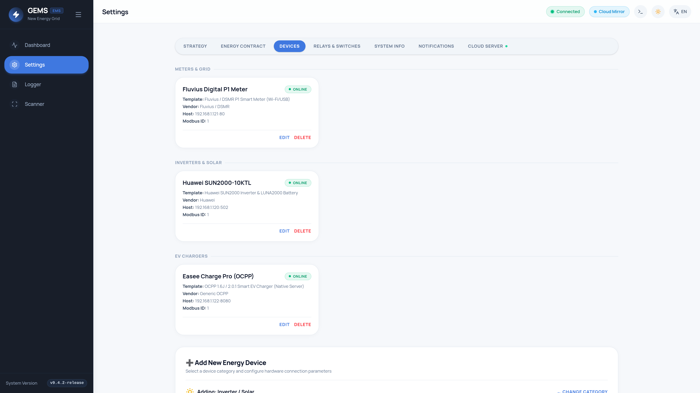
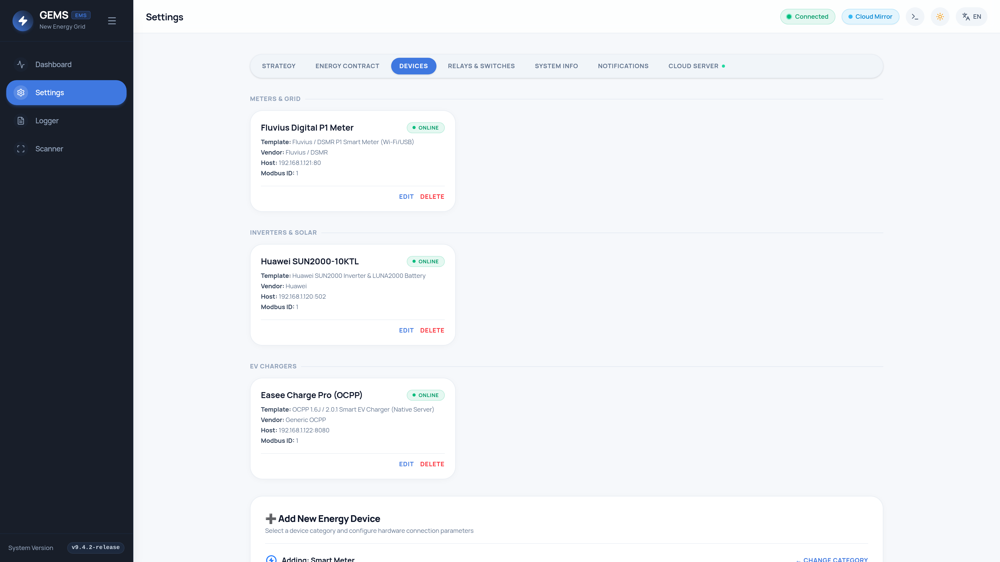

# GEMS User Manual

Welcome to the comprehensive user manual for GEMS (Grid Energy Management System by New Energy Grid). GEMS is a lightweight, highly responsive, and fully UI-driven Energy Management System optimized for low-power devices like the Raspberry Pi. This manual details how to set up, configure, and optimize your smart home energy usage using the available features and parameters.

> [!TIP]
> **Download Official Field Manuals (PDF):**
> - 📕 **[GEMS Installer & Commissioning Manual (PDF)](../manuals/gems-installer-manual.pdf)** (5.8 MB)
> - 📗 **[GEMS Homeowner & User Manual (PDF)](../manuals/gems-user-manual.pdf)** (3.6 MB)
> - ☁️ **[GEMS GRID-EMS-SERVER Connection Manual (PDF)](../manuals/gems-server-connection-manual.pdf)** (1.0 MB)
> - 💻 **[Interactive Documentation Hub](../manuals/index.html)**


---

## 1. Introduction & Architecture Overview

GEMS serves as the central brain of your home energy ecosystem, integrating Grid, Solar, Battery, EV Charger, and Smart Relay hardware. By seamlessly monitoring real-time power usage and acting upon defined optimization strategies, it helps reduce electricity costs, maximize self-consumption, and protect you from high capacity grid tariffs.

### Core Philosophy
* **Fully UI-Driven:** Zero YAML or text configuration file editing is required. Every hardware device and optimization rule is configured straight from the frontend interface.
* **90+ Native Hardware Templates:** Out-of-the-box support for 80+ leading manufacturers across Solar Inverters, Batteries, EV Chargers (OCPP / Modbus TCP / REST), Digital P1 Meters, and Smart Relays.
* **Responsive Architecture:** A highly optimized Go backend paired with an embedded SQLite database and a modern Vue 3 SPA guarantees snappy updates using Server-Sent Events (SSE) and WebSockets.
* **Minimal Wear:** Database writes are batched and buffered with SQLite WAL mode to maximize the lifespan of your device's SD Card or NVMe SSD.
* **Privacy First:** All data is processed and stored locally inside your home.

---

## 2. Reference Hardware & Installation

### Official Tested Reference Platform
* **Kit:** [db-tronic Raspberry Pi 5 4GB NVMe Kit](https://www.amazon.com.be/-/en/dp/B0GZ65XG3G?ref=ppx_yo2ov_dt_b_fed_asin_title&th=1) (includes 27W Power Supply, metal case, active cooler, NVMe HAT, and 64GB MicroSD).
* **Storage:** [Patriot P300 128GB M.2 NVMe SSD](https://www.amazon.com.be/-/en/dp/B0822Y6N1C?ref=ppx_yo2ov_dt_b_fed_asin_title&th=1) (PCIe Gen 3 x4).
* See [Hardware Reference BOM](hardware_reference.md) for full specs and pinouts.

### Deployment Method A: High-Speed NVMe M.2 SSD (Recommended)
Booting GEMS from the Patriot P300 NVMe SSD delivers maximum speed and eliminates SD card wear:
1. **Update Pi 5 Bootloader (1-time):** Use Raspberry Pi Imager to write *Misc utility images* &rarr; *Bootloader* &rarr; *NVMe/PCIe Boot* onto the 64GB MicroSD card. Insert into the Pi 5 and power on for 5 seconds until the screen turns green (`BOOT_ORDER=0xf461`, `PCIE_PROBE=1`).
2. **Flash GEMS Image:** Flash `gems-os-image.img.xz` to the Patriot P300 SSD.
3. Remove the MicroSD card and power on. System boots in under 8 seconds.
*For step-by-step instructions and terminal commands, see the dedicated [NVMe Boot & Setup Manual](nvme_boot_guide.md).*

### Deployment Method B: Custom OS Image on MicroSD Card
1. Download `gems-os-image.img.xz` from the GitHub releases page.
2. Flash it to an 8GB+ MicroSD card using BalenaEtcher or Raspberry Pi Imager.
3. Insert into the Raspberry Pi and boot.
4. Access `http://ems.local` or `http://ems.local:9090` (Cockpit terminal: `admin` / `manufacturer`).

### Deployment Method C: Debian Package (.deb)
If running an existing Debian or Ubuntu ARM64 installation:
```bash
sudo dpkg -i gems_*_arm64.deb
sudo apt-get install -f
```
The `gems.service` systemd daemon will start automatically on port `8080`.

---

## 3. Dashboard & Real-Time Monitoring

| Desktop PowerFlow Dashboard | Mobile Responsive View |
| :---: | :---: |
|  |  |

* **Power Flow Interactive Graphic:** Displays active power nodes (Grid, Solar, Battery, Charger, Home). Nodes are intelligently hidden if not configured or inactive.
* **Click-to-Reveal:** Clicking any individual node in the power flow diagram reveals detailed historical line charts, energy breakdown metrics, and time-range selections (Day, Week, Month, Year).

| Solar History Modal | Battery Telemetry Modal |
| :---: | :---: |
|  |  |

| Grid History Modal | EV Charger Modal |
| :---: | :---: |
|  |  |

* **Metrics Board:** Provides an aggregated daily view of solar yield, grid import/export totals, and self-consumption ratios.

---

## 4. Global Settings & Configurations

Access the **Settings** view from the top navigation bar to configure system-wide rules and energy contracts.

### 4.1 Site Optimization (Strategy Mode)

| Strategy Settings Overview | Operational Strategy Modes |
| :---: | :---: |
|  |  |

* **`strategy_mode`**: Selects the primary operational behavior of the system.
  * **Eco:** Maximizes self-consumption of solar energy. Prioritizes home loads, battery charging, and EV charging with solar excess before grid export.
  * **Flanders:** Activates predictive Peak Shaving based on the Belgian/Flanders capacity tariff model. Calculates rolling 15-minute projected quarter peaks and dynamically throttles EV chargers and batteries to keep the peak under `capacity_peak_limit_kw`.
  * **Netherlands:** Focuses on minimizing or completely eliminating solar feed-in to the grid (zero-export), actively curtailing inverters if export reaches `allowed_grid_export_kw` or if feed-in pricing is negative.
* **`capacity_peak_limit_kw`**: The base maximum allowed average quarter-hour grid import (e.g. `2.5` kW).
* **`peak_shaving_buffer_w`**: The safety buffer applied when nearing the capacity peak limit (e.g. `200` W).
* **`peak_shaving_rampup_w`**: Ramp-up step power when capacity frees up (e.g. `150` W).
* **Smart Adaptive Ceiling**: Dynamically adapts the peak shaving ceiling to the highest 15-minute peak already incurred in the current calendar month, maximizing charging speed without increasing your capacity tariff bill.

### 4.2 Battery Arbitrage & Schedules

* **`battery_grid_charge_strategy`**:
  * `price_only`: Charges from grid when EPEX spot price drops below `force_charge_below_euro`.
  * `super_dal_only`: Restricts grid charging to specific provider off-peak contract windows (e.g. Engie Superdal).
  * `hybrid`: Combines spot price thresholds with provider contract windows.
  * `dynamic_forecast`: Solves optimal charge/discharge schedules based on solar forecasts and baseline consumption.
* **`force_charge_below_euro`**: Spot price threshold (€/kWh) to trigger forced grid charging.
* **`force_discharge_above_euro`**: Spot price threshold (€/kWh) to allow battery feed-in during peak pricing.

### 4.3 Energy Contracts & 24-Hour Tariff Visualizer

| Energy Contract Configuration | 24-Hour Tariff Visualizer Curve |
| :---: | :---: |
|  |  |

* **`contract_type`**: Support for Belgian dynamic contracts (**TotalEnergies Pixel Dynamic, Mega Smart/Cosy Dynamic, Bolt Dynamisch, Engie Dynamic / Flextime, Luminus Dynamic, Eneco Dynamic, Frank Energie, Ecopower, Dats 24, Octa+, Trevion, Aspiravi**), Belgian Dual-Tariff (Piek/Dal + 6% BTW), and generic fixed/dynamic rates.
* **DNO Distribution Fees**: Built-in regional presets for Fluvius (Flanders), ORES (Wallonia), RESA (Liège), and SIBELGA (Brussels).
* **Live 24-Hour Tariff Visualizer**: Real-time stacked cost breakdown curve displaying wholesale EPEX spot price, supplier markup, DNO network fees, taxes & 6% VAT, dynamic solar injection price, and negative price curtailment warnings.

---

## 5. Device Management & Step-by-Step Onboarding

GEMS includes **90 native hardware templates**. Adding hardware is 100% UI-driven.

| Configured Devices Management | Add Device Category Wizard |
| :---: | :---: |
|  |  |

### Universal 4-Step Onboarding Process

1. **Subnet Scan:** Click **Scanner** in the sidebar to scan your local network. GEMS identifies devices by IP, open ports (502, 80), and vendor MAC OUIs (Huawei, RAEDIAN, Shelly, Raspberry Pi, etc.).
   
   

2. **Hardware Preparation:**
   * **Modbus Inverters:** Enable Modbus TCP in your inverter dongle or app (e.g. Huawei FusionSolar SDongleA Modbus TCP: Unrestricted, SMA Speedwire / SunSpec, SolarEdge SetApp Port 1502).
   * **EV Chargers:** Enable Modbus TCP in your charger (preferred for sub-second throttling & CPO billing coexistence), or set the Central System URL in your charger app to `ws://<GEMS-IP>:8887/<ChargePointID>` for native OCPP.
   * **Local REST Meters/Relays:** Toggle "Local API" in HomeWizard Energy app, or enable Gen2 RPC in Shelly devices.
   * **Serial P1 Meters:** Plug RJ12 cable into smart meter P1 port and USB into Raspberry Pi (`/dev/ttyUSB0`).

3. **Add Device in UI:** Click **Settings &rarr; Devices &rarr; + Add Device**. Choose category, select template, enter parameters, and click **Save Device**.

| Inverter Modbus Setup | Smart Meter P1 Setup | EV Charger Setup |
| :---: | :---: | :---: |
|  |  |  |

4. **Verify Health:** Confirm the device card shows <span style="color:#10b981; font-weight:bold;">● Online</span> and verify live power on the Dashboard.

---

### 5.1 Solar & Hybrid Inverters (24 Templates)

| Template | Brand & Series | Protocol | Default Port | Slave ID | Curtailment |
| :--- | :--- | :--- | :--- | :--- | :--- |
| `huawei_inverter` | Huawei SUN2000 (L1/M1/M2/M3/MB0 + LUNA2000) | Modbus TCP | `502` | `1` (or `2`) | Yes |
| `sma_inverter` | SMA Sunny Boy / Tripower / Storage | Modbus TCP | `502` | `126` (or `3`) | Yes |
| `solis_inverter` | Solis Hybrid (RHI / S5 / S6) | Modbus TCP | `502` / `8899` | `1` | Yes |
| `fronius_inverter` | Fronius Gen24 Plus / Symo / Primo | Modbus TCP SunSpec | `502` | `1` | Yes |
| `solaredge_inverter` / `solaredge_3phase` | SolarEdge Single & 3-Phase (SetApp) | Modbus TCP SunSpec | `1502` (or `502`) | `1` | Yes |
| `sungrow_inverter` | Sungrow Hybrid (SH5.0 - SH10RT) | Modbus TCP | `502` | `1` | Yes |
| `victron_inverter` | Victron Cerbo GX / MultiPlus-II / Venus OS | Modbus TCP | `502` | `100` / `228` | Yes |
| `goodwe_inverter` | GoodWe Hybrid (ET / EH / ES / EM) | Modbus TCP | `502` / `8899` | `247` | Yes |
| `growatt_inverter` | Growatt (SPH / MIN / MOD / MID) | Modbus TCP | `502` | `1` | Yes |
| `solax_inverter` | SolaX Hybrid (X1 / X3 Gen 2/3/4) | Modbus TCP | `502` | `1` | Yes |
| `sofarsolar_hybrid` | SofarSolar (HYD / G3 / AMASS) | Modbus TCP | `8899` / `502` | `1` | Yes |
| `deye_inverter` | Deye / Sunsynk Hybrid Inverters | Modbus TCP | `502` / `8899` | `1` | Yes |
| `foxess_inverter` | FoxESS Hybrid (H1 / H3 / H3-Pro / AC1) | Modbus TCP | `502` | `1` / `247` | Yes |
| `sigenergy_hybrid` | Sigenergy SigenStor (5-in-1 ESS) | Modbus TCP | `502` | `1` | Yes |
| `enerlution_inverter` | Enerlution Hybrid Inverter | Modbus TCP | `502` | `1` | Yes |
| `alpha_ess_inverter` | Alpha ESS Storion (SMILE5 / SMILE-T10) | Modbus TCP | `502` / `8502` | `85` | Yes |
| `anker_inverter` | Anker SOLIX X1 Hybrid | Modbus TCP | `502` | `1` | Yes |
| `lg_ess` | LG ESS Home (8 / 10 / 15) | Local REST | `80` / `443` | — | Yes |
| `enphase_envoy` | Enphase IQ Gateway / Envoy-S | Local REST | `80` / `443` | — | Yes |

---

### 5.2 EV Charging Stations (38 Templates)

#### Modbus TCP EV Chargers (Recommended & Preferred)
**Modbus TCP is the preferred connection option for EV chargers**:
* **Sub-Second Throttling:** Direct register writes allow instantaneous current adjustments (6A to 32A), critical for Flanders capacity tariff peak shaving and rapid solar curtailment.
* **CPO / Billing Coexistence:** If your charger connects to an employer billing reimbursement platform or CPO (E-Flux, Road, Optimile, Easee Cloud) via OCPP, GEMS controls charging power locally over Modbus TCP *without interfering with or disconnecting your cloud billing service*.
* **Supported Models:**
  * **RAEDIAN NEO / NEX / Gemini AC Wallbox:** Template `raedian_charger`, Port `502`, Slave ID `1` (or `2` for Gemini Dual).
  * **KEBA KeContact P30 / P40:** Template `keba_charger`, Port `502`, Slave ID `255`.
  * **Mennekes AMTRON Xtra / Premium:** Template `mennekes_modbus`, Port `502`, Slave ID `1`.
  * **Webasto Next / Live:** Template `webasto_charger`, Port `502`, Slave ID `1`.
  * **ABB Terra AC Wallbox:** Template `abb_charger`, Port `502`, Slave ID `1`.
  * **Alfen Eve Single / Double Pro-Line:** Template `alfen_charger`, Port `502`, Slave ID `1`.
  * **Peblar EV Charger:** Template `peblar_charger`, Port `502`, Slave ID `1`.
  * **Phoenix Contact EV-CC / CHARX / Veton:** Template `phoenix_contact_evcc`, Port `502`, Slave ID `1`.
  * **GoodWe HCA Wallbox / Sigenergy SigenStor EVAC:** Template `goodwe_charger` / `sigenergy_evac`.
  * **SolarEdge Home EVSE:** Template `solaredge_evse`, Port `502`, Slave ID `1`.

#### Native OCPP 1.6-J / 2.0.1 EV Chargers (Direct Alternative)
For chargers without Modbus TCP or standalone residential setups without third-party CPO billing platforms:
* Set the Central System URL in your charger mobile app / web console to:
  ```
  ws://<GEMS-IP>:8887/<ChargePointID>
  ```
* **Supported Models:** Huawei FusionCharge (SCharger-7KS/22KT), EVBox (Elvi/Livo/BusinessLine), Mennekes AMTRON (4You/4Business/ACU), SMA EV Charger (7.4/22), Schneider Electric EVlink (Wallbox/Pro AC), Siemens VersiCharge GEN3, Elli / VW / Skoda / SEAT (ID. Charger Connect/Pro), Alpitronic Hypercharger, Autel MaxiCharger, Hager witty, BMW Wallbox Plus, Mercedes-Benz Wallbox, Porsche Wallbox, Fronius Wattpilot, Easee.
* **In GEMS UI:** Select EV Chargers &rarr; Choose Template: `OCPP 1.6J / 2.0.1 Smart EV Charger` &rarr; Enter your `ChargePointID` (e.g. `WALLBOX-01`).

#### REST & Cloud EV Chargers
* **go-e Charger Gemini / HOMEfix / PRO:** Template `goe_charger`, Local HTTP REST Port `80` (enable Local API v2 in go-e app).
* **SmartEVSE v2 / v3:** Template `smartevse_charger`, Local REST Port `80`.
* **Wallbox Pulsar Plus / Commander / Zaptec Go:** Cloud REST templates with API credentials.

---

### 5.3 Grid & Smart Meters (26 Templates)

* **P1 Smart Meter (USB / Serial):** Template `p1_serial`. Serial port `/dev/ttyUSB0`, Baud `115200` (DSMR 4/5) or `9600` (DSMR 2/3). Plug RJ12 cable into meter and USB into Raspberry Pi.
* **P1 Smart Meter (Network / TCP Bridge):** Template `p1_network`. Host IP and Port (e.g. `23`, `8088`, `8234`).
* **HomeWizard Wi-Fi P1 Meter:** Template `homewizard_meter`. Host IP, Port `80`. (Enable *Local API* in HomeWizard Energy app).
* **Homey Energy Dongle:** Template `homey_p1`. Local network P1 broadcast.
* **Shelly 3EM / Pro 3EM / Gen3 3EM-63T:** Templates `shelly_3em`, `shelly_pro_3em`. Host IP, Port `80`.
* **Eastron SDM120 / SDM230 / SDM630 / SDM72D / SMART X96:** Templates `eastron_sdm120_230`, `eastron_sdm630`, `eastron_sdm72_x96`. Modbus TCP Port `502`, Slave ID `1`.
* **Carlo Gavazzi EM112 / EM340 / EM540 / EM24:** Templates `carlogavazzi_em340`, `carlogavazzi_em24`. Modbus TCP Port `502`, Slave ID `1`.
* **ABB A43 / A44 / B23 / B24 Meter:** Template `abb_meter`. Modbus TCP Port `502`, Slave ID `1`.
* **Schneider Electric Acti9 iEM3000 / PM3200:** Template `schneider_iem3000`. Modbus TCP Port `502`, Slave ID `1`.
* **Siemens SENTRON PAC2200 / 7KT1665:** Template `siemens_pac2200`. Modbus TCP Port `502`, Slave ID `1`.
* **SMA Energy Meter 2.0 / Data Manager M:** Template `sma_energymeter`. Modbus TCP Port `502`, Slave ID `2`.
* **Socomec COUNTIS E24/E34/E44 / DIRIS A-40:** Template `socomec_meter`. Modbus TCP Port `502`, Slave ID `1`.
* **WAGO 879 Series (879-3000/3020/3040):** Template `wago_879`. Modbus TCP Port `502`, Slave ID `1`.
* **Eltako DSZ15DZMOD / Finder 7M / Inepro PRO380 / Lovato DMG610 / Acrel ADW300 / ESPHome / Loxone / Niko.**

---

### 5.4 Smart Relays & Contactors (2 Templates)

| Smart Relays Management | Relay Automation Rules |
| :---: | :---: |
|  |  |

* **Shelly Plus 1PM / Pro 1PM / Plug S:** Template `shelly_plus_1pm`. Host IP, Port `80`. Controls SG-Ready heat pump boost contactors and electric boilers based on solar excess threshold (e.g. >1500W) and thermal hysteresis timers.
* **Generic HTTP Relay:** Template `generic_relay`. Configurable state and toggle URLs for ESPHome, Tasmota, and custom actuators.

---

## 6. System Diagnostics & Updates

| Hardware System Info & NVMe Health | Webhook Alerts & Reporting |
| :---: | :---: |
|  |  |

* **Real-Time Logger:** Live diagnostic stream of Modbus packets, register reads, OCPP WebSocket heartbeats, and strategy control decisions.
* **One-Click OTA Updates:** System queries GitHub releases for updates. Clicking *Install Update* downloads and installs the latest `.deb` package seamlessly with live log output.
* **Webhook & Notifications:** Automated Discord/Slack/Custom webhook notifications on 90% capacity warnings, polling timeouts, and price fetch errors.


